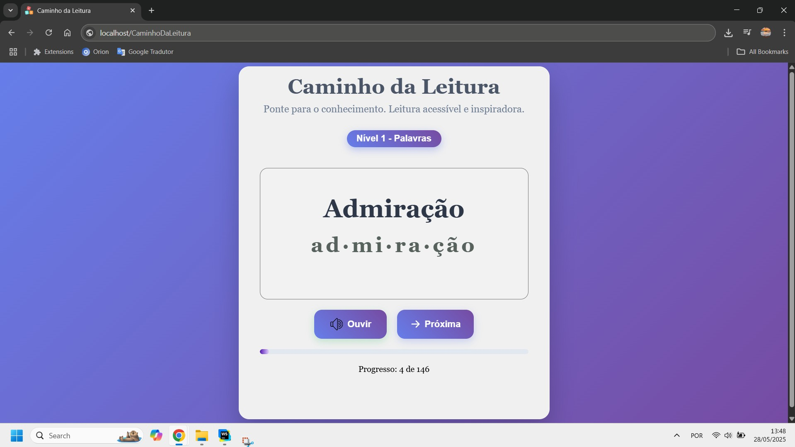

# 📚 Caminho da Leitura 📖

Um aplicativo web simples e intuitivo, desenvolvido com o objetivo nobre de apoiar **pessoas semialfabetizadas** em sua jornada para melhorar o nível de leitura e construir confiança.

## ✨ O Problema e a Solução

A alfabetização é a base para o desenvolvimento pessoal e social. No Brasil e em muitos lugares do mundo, ainda há um número significativo de adultos e jovens que precisam de apoio para desenvolver suas habilidades de leitura.

"Caminho da Leitura" surge como uma ferramenta **acessível e autônoma**, permitindo que indivíduos pratiquem a leitura no seu próprio ritmo, construindo confiança e fluência passo a passo. É um recurso prático para quem busca aprimorar a leitura de forma independente.

## 💡 Como Funciona & Funcionalidades Principais

O "Caminho da Leitura" é projetado para ser direto e eficaz, seguindo um ciclo simples de aprendizado e autoavaliação:

1.  **Leitura Interativa:** Uma palavra ou frase é exibida claramente na tela. O utilizador lê em voz alta, praticando a pronúncia e o reconhecimento visual.
2.  **Verificação Auditiva:** Após a tentativa, o utilizador clica no botão "Ouvir" (ou similar) para escutar a pronúncia correta da palavra ou frase por meio de áudio de alta qualidade.
3.  **Autoavaliação e ‘Feedback’:** O utilizador compara a sua leitura com o áudio fornecido, verificando se acertou. Este feedback imediato é crucial para o aprendizado e a correção de eventuais erros.

**Principais características:**

*   **Interface Simples:** Design limpo e minimalista para evitar distrações e facilitar o uso por qualquer pessoa.
*   **Feedback Instantâneo:** Compare a sua leitura com o áudio oficial com apenas um clique.
*   **Progressão Estruturada:** Níveis de dificuldade crescentes para um aprendizado contínuo e gradual.
*   **Acessibilidade:** Desenvolvido como um aplicativo web, pode ser acessado de qualquer dispositivo com navegador e internet.

## Para quem é indicado?

## 📈 Níveis de Progresso

O aplicativo é estruturado em níveis de dificuldade crescente, projetados para guiar o aprendizado de forma gradual e eficaz, do reconhecimento de palavras simples à compreensão de frases mais complexas:

### Nível 1: Palavras Isoladas
*   **Conteúdo:** 146 palavras individuais.
*   **Objetivo:** Focar no reconhecimento de palavras básicas, na associação de letras e sons (fonética), e na construção de um vocabulário fundamental.
*   **Divisão silábica:** Palavra apresentada com destaque visual das suas sílabas (ex:, "ad·mi·ra·ção"), permitindo que o utilizador pratique a leitura e a pronúncia segmentada. 

### Nível 2: Frases Curtas
*   **Conteúdo:** 50 frases curtas (aproximadamente 5 palavras cada).
*   **Objetivo:** Iniciar a prática da leitura contextualizada, compreendendo como as palavras se combinam para formar ideias simples, e desenvolvendo a fluência em pequenos blocos.

### Nível 3: Frases de Complexidade Média
*   **Conteúdo:** 25 frases um pouco mais longas (aproximadamente 11 palavras cada).
*   **Objetivo:** Desafiar o leitor com estruturas de frase um pouco mais complexas, aumentando a fluência, a velocidade de leitura e a compreensão de mensagens mais elaboradas.

## Experimental

Este é um projeto experimental e será expandido a depender dos feedbacks recebidos.

## 🛠️ Tecnologias Utilizadas

Este projeto foi construído utilizando as seguintes tecnologias:

*   **Frontend:** HTML5, CSS3, JavaScript
*   **Áudio:** Áudio gerado utilizando ElevenLabs

## 📸 Demonstração / Screenshots

*  GitHub Page **[Caminho da Leitura Online](https://eliaspereirah.github.io/CaminhoDaLeitura)** 

 * 

Desenvolvido com ❤️ por [EliasPereirah](https://github.com/EliasPereirah)